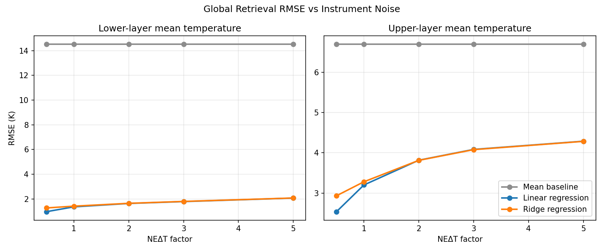
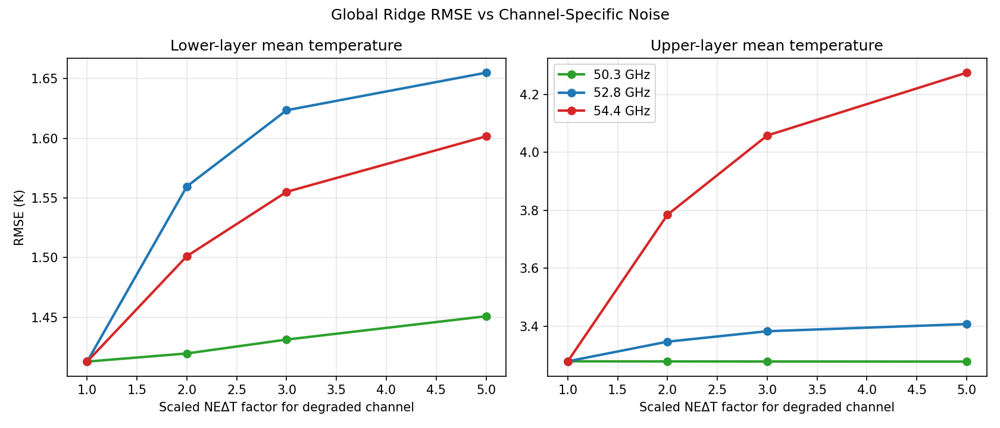
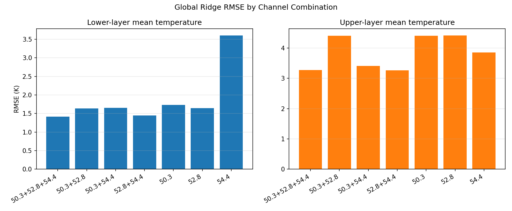
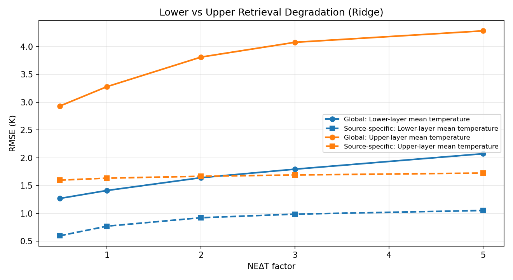

# Microwave Satellite Atmospheric Retrieval: Channel Sensitivity, Noise Propagation, and Instrument Trade-Off Analysis

## Overview

This repository contains a physics-first Python/PyARTS research pipeline for studying how microwave radiative transfer, oxygen-band channel design, and instrument noise affect atmospheric temperature retrieval accuracy.

The project is intentionally a **controlled research prototype**:

- clear-sky only
- interpretable by design
- based on simple linear retrieval models
- focused on validation before scaling
- not an operational retrieval system

The current pipeline connects forward simulation, instrument modeling, sensitivity analysis, and retrieval diagnostics into one reproducible workflow for research-grade instrument trade-off studies.

## Scientific Motivation

Microwave temperature sounding channels in the oxygen absorption band carry vertically distributed information about atmospheric temperature. In practice, that information depends on:

- the atmospheric regime,
- the selected channel set,
- the instrument noise level, and
- the retrieval target being estimated.

This project asks a focused question:

**How do channel choice and instrument noise propagate into lower-layer and upper-layer temperature retrieval accuracy under a simple, interpretable clear-sky framework?**

Rather than jumping to complex retrieval methods, the repository builds understanding from the bottom up:

1. validate clear-sky forward radiative transfer,
2. add a minimal instrument model,
3. quantify sensitivity and noise propagation,
4. evaluate simple linear retrieval behavior,
5. use that structure to reason about instrument trade-offs.

## Repository Structure

```text
mw-sat-atmos-retrieval/
├── configs/                      # Project and experiment configuration placeholders
├── data/
│   ├── raw/                      # Local ERA5 NetCDF subsets (gitignored)
│   └── processed/experiments/    # Curated experiment tables used by reports
├── docs/                         # Supporting methodology and experiment overview notes
├── reports/
│   ├── figures/experiments/      # Diagnostic figures curated for the project
│   ├── project_summary.md
│   ├── noise_sweep_retrieval_interpretation.md
│   ├── channel_noise_sensitivity_interpretation.md
│   ├── channel_ablation_interpretation.md
│   └── final_retrieval_system_analysis.md
├── scripts/                      # Reproducible forward, retrieval, and diagnostic experiments
├── src/mwsat/                    # Reusable instrument, forward, profile, and experiment helpers
├── tests/                        # Lightweight unit coverage for reusable components
├── environment.yml
├── pyproject.toml
└── README.md
```

## Forward Model

The forward model is built around clear-sky PyARTS and ERA5 pressure-level profiles.

Current validated ingredients:

- ERA5 temperature `t`
- ERA5 specific humidity `q`
- ERA5 geopotential `z`
- geopotential-derived altitude
- oxygen absorption via `O2-PWR98`
- water-vapor absorption via `H2O-PWR98`
- Planck brightness temperature output

The forward model is exercised both in a minimal ARTS smoke test and in a broader ERA5 profile experiment pipeline.

## Instrument Setup

The current instrument abstraction is intentionally minimal:

- three channels:
  - `50.3 GHz`
  - `52.8 GHz`
  - `54.4 GHz`
- channel-specific `NEΔT`
- additive Gaussian channel noise
- deterministic profile-level seeding for reproducibility

This is enough to test how retrieval accuracy responds to bulk noise changes, channel-specific degradation, and channel removal without adding unnecessary instrument complexity.

## Dataset and Regimes

The project uses a small, structured set of ERA5-derived profiles plus synthetic stress-test profiles.

Current real ERA5 regimes:

1. `winter_midlatitude_maritime_sample`
2. `lower_latitude_maritime_2020`
3. `high_latitude_continental_2020`

These regimes provide:

- cold maritime conditions,
- warm/humid maritime conditions,
- cold/dry continental conditions.

Synthetic stress-test profiles remain included as explicitly labeled out-of-distribution cases, but they are not used as ordinary training data in the main retrieval experiments.

## Retrieval Targets

The current retrieval system focuses on two scalar temperature targets:

- `lower_layer_mean_temperature_k`
- `upper_layer_mean_temperature_k`

These targets are intentionally simple. They let the project test whether the current channel set carries interpretable lower-layer and upper-layer temperature information before attempting full profile retrieval.

## Retrieval Models

The retrieval models remain deliberately minimal and transparent:

- mean baseline
- linear regression
- ridge regression

No nonlinear models, neural networks, or added predictors are used in the core trade-off experiments. This keeps the interpretation tied directly to channel physics and measurement noise.

## Experiments

The repository now includes a complete sequence of controlled experiments.

### Forward and Sensitivity

- `scripts/test_arts_era5_profile.py`
  - clear-sky ERA5 forward simulation
  - multi-profile experiment generation
  - temperature, layer, and humidity sensitivity outputs

### Retrieval Baselines and Diagnostics

- `scripts/run_linear_retrieval_experiment.py`
- `scripts/plot_retrieval_diagnostics.py`
- `scripts/run_cross_regime_retrieval_experiment.py`
- `scripts/run_regime_aware_retrieval_experiment.py`
- `scripts/run_retrieval_by_target_experiment.py`

### Instrument Trade-Off Experiments

- `scripts/run_noise_sweep_retrieval_experiment.py`
- `scripts/run_channel_noise_sensitivity_experiment.py`
- `scripts/run_channel_ablation_experiment.py`

These experiments provide the core evidence for the current channel-prioritization and noise-propagation conclusions.

## Key Findings

The current validated results support the following conclusions:

- Global linear retrieval is **not regime-invariant**.
- Source-specific retrieval improves within-regime performance.
- Lower-layer retrieval is mainly controlled by **52.8 GHz**.
- Upper-layer retrieval is mainly controlled by **54.4 GHz**.
- Retrieval error increases smoothly as `NEΔT` increases.
- Channel-specific degradation confirms target-dependent channel importance.
- `52.8 + 54.4 GHz` is the strongest reduced channel pair.
- `50.3 GHz` contributes less unique information for the current scalar targets.

These findings are consistent across the sensitivity, retrieval, channel-noise, and channel-ablation experiments, while remaining subject to the small-sample and clear-sky limitations described below.

## Main Figures

### Global retrieval degradation under increasing instrument noise



### Channel-specific noise sensitivity



### Channel ablation and minimal useful channel subset



### Lower vs upper target degradation



## Main Reports

The following curated reports summarize the scientific interpretation of the completed experiments:

- [Project Summary](reports/project_summary.md)
- [Noise Sweep Retrieval Interpretation](reports/noise_sweep_retrieval_interpretation.md)
- [Channel Noise Sensitivity Interpretation](reports/channel_noise_sensitivity_interpretation.md)
- [Channel Ablation Interpretation](reports/channel_ablation_interpretation.md)
- [Final Retrieval System Analysis](reports/final_retrieval_system_analysis.md)

Supporting method notes:

- [Methodology](docs/methodology.md)
- [Experiment Overview](docs/experiment_overview.md)

## Limitations

The current system has important and intentional limitations:

- clear-sky only
- no clouds, scattering, or precipitation
- synthetic noisy observations rather than real satellite data
- small ERA5-derived dataset
- linear retrieval models only
- scalar temperature targets only
- profile-level and source-specific cross-validation are not equivalent to global operational generalization

These results should therefore be interpreted as research-grade controlled diagnostics, not as claims of operational retrieval readiness.

## How to Run

Create the environment:

```bash
conda env create -f environment.yml
conda activate mwsat
```

Generate or refresh the curated experiment tables from the ERA5 profile workflow:

```bash
conda run -n mwsat python scripts/test_arts_era5_profile.py
```

Run the target-specific retrieval experiment:

```bash
conda run -n mwsat python scripts/run_retrieval_by_target_experiment.py
```

Run the bulk instrument-noise sweep:

```bash
conda run -n mwsat python scripts/run_noise_sweep_retrieval_experiment.py
```

Run the one-channel-at-a-time degradation experiment:

```bash
conda run -n mwsat python scripts/run_channel_noise_sensitivity_experiment.py
```

Run the channel ablation experiment:

```bash
conda run -n mwsat python scripts/run_channel_ablation_experiment.py
```

Generate diagnostic figures:

```bash
conda run -n mwsat python scripts/plot_experiment_diagnostics.py
conda run -n mwsat python scripts/plot_retrieval_diagnostics.py
```

## Environment Setup

The project currently uses a Conda environment:

```bash
conda env create -f environment.yml
conda activate mwsat
```

The environment must include:

- Python
- NumPy
- pandas
- matplotlib
- scikit-learn
- PyARTS
- ruff

## Project Status

This repository is now a coherent, validated **research-grade portfolio project** centered on:

- clear-sky microwave forward simulation,
- controlled atmospheric sensitivity analysis,
- simple interpretable retrieval experiments,
- instrument-noise propagation analysis,
- and channel trade-off diagnostics.

It is mature enough to demonstrate scientific reasoning, reproducible experimentation, and instrument-analysis thinking. It is not yet a complete retrieval framework and should not be presented as one.

## Future Work

The most meaningful next steps are:

- broaden atmospheric diversity further,
- move beyond scalar targets toward richer state descriptions,
- test more realistic uncertainty sources,
- examine clouds/scattering in a later controlled phase,
- and compare the current linear framework with more formal inverse methods while preserving interpretability.

For now, the repository’s main value is that it provides a clean, traceable framework for studying how channel physics and instrument noise map into retrieval behavior.
